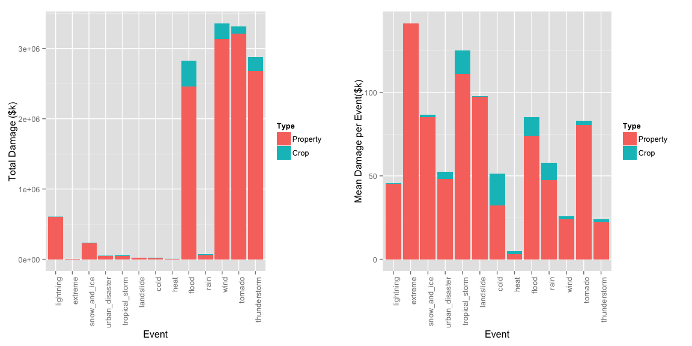

# Storm & Weather Event Analysis


```
## Loading required package: ggplot2
## Loading required package: xtable
```

###Introduction

This analysis addresses some specific questions about storm and weather severity and economic impact.  

Specifically:  

1. Across the United States, which types of events (as indicated in the EVTYPE variable) are most harmful with respect to population health?  

2.  Across the United States, which types of events have the greatest economic consequences?

###synopsis


This report summarizes the impact of twelve dinstinct weather event types in terms of both health impact (as measured by fatalities and injuries) and economic impact (as measured by both property damage and crop damage).  

The analysis looks at the total event impact over the measurement period, in addition to the per event impact.  

We find that while tornados dominate the total number of health impacts, the most severe event types are extreme (record temeprature) and heat events in terms of the number of affected people per event.  

Tornados also top the total property and crop damage impacts, but on a per event basis, tropical storm are worse in terms of overall economic impact and floods nearly rival these top two in terms of per event economic damage.  


###data processing  

Data are read directly from teh .bz2 file stored locally on the disk. 


```r
## well, this actually works!
## read csv file directly from the disk
Storms <- read.csv("repdata-data-StormData.csv.bz2", header=TRUE)
```


```r
#reduce number of columns, retaining only columns of interest
Storm2 <- Storms[,c(2,7,8,23,24,25,27)]

#get dimensions of raw data
numbah1<-dim(Storm2)

##keep only complete cases
        Storm2 <-Storm2[complete.cases(Storm2), ]

##ensure each event has some finite impact
        Storm2<-Storm2[(Storm2$FATALITIES+Storm2$INJURIES+Storm2$CROPDMG+Storm2$PROPDMG) >0, ]

numbah2<-dim(Storm2)
```

The reduction above of the data into "impactful severe events" reduced the number of elements from 902297 to 254633 line items.  


From this point I followed a slightly unconventional path. I noticed that the EVTYPE classification were not entirely consistently entered. Event codes for event types that seemed identical we sometime different. For instance "WIND" and "WND". THUNDERSTORM and TSTM. In addition, in some cases things like TORNADO and WIND were mixed together, making classification ambiguous.  

I decided, therefore, to make things a little more complicated and do some data cleaning by separating the classifications into thirteen separate types. Note that if an event had two classifications (TSTM and WIND) it would be double counted in this scenario.  

The severe weather types classified are:  
1.  thunderstorm  
2.  tornado  
3.  wind  
4.  rain  
5.  flood  
6.  heat  
7.  cold  
8.  tropical_storm  
9.  urban_disaster  
10. snow_andice  
11. extreme  
12. lightning  


```r
## the purpose of this section is to search, extract, and catagorize "like" events from the data.
## to simplify adn improve readability, I define a function which requires and output category and a search string. 


#reset disasters matrix
disasters<-NULL

## disaster extraction function
        ## the function passes a name string (weather category under which the output is 
        ## categorized) and a search string (which is one of various ways weather under the
        ## category could have been entered)

        ## output is an updated disasters data frame
        ## and input data is the Storm2 data frame

        disaster_x <- function(name_string, search_string, output=disasters, input=Storm2) { 
                temp <- input[grepl(search_string, input$EVTYPE, ignore.case=TRUE), ]
                temp<- cbind (rep(name_string, dim(temp)[1]), temp)
                rbind(temp, output)
                }

##classication
##final classification is the first variable and the search string is the second variable.

        disasters<-disaster_x("thunderstorm", "TSTM")
        disasters<-disaster_x("thunderstorm", "THUNDER")

        disasters<-disaster_x("tornado", "TORN")

        disasters<-disaster_x("wind", "WND")
        disasters<-disaster_x("wind", "wind")

        disasters<-disaster_x("rain", "rain")

        disasters<-disaster_x("flood", "fld")
        disasters<-disaster_x("flood", "flood")

        disasters<-disaster_x("heat", "warm")
        disasters<-disaster_x("heat", "heat")

        disasters<-disaster_x("cold", "cool")
        disasters<-disaster_x("cold", "cold")

        disasters<-disaster_x("landslide", "mud")
        disasters<-disaster_x("landslide", "landsl")

        disasters<-disaster_x("tropical_storm", "tropic")

        disasters<-disaster_x("urban_disaster", "urban")

        disasters<-disaster_x("snow_and_ice", "snow")
        disasters<-disaster_x("snow_and_ice", "ice")
        disasters<-disaster_x("snow_and_ice", "icy")

        disasters<-disaster_x("extreme", "record")

        disasters<-disaster_x("lightning", "lightn")

numbahd<-dim(disasters)
```

The classification results in 343200 rows of data.  
The table below is a small random subset of the final data.


```r
#The section prints a random subset of the cleaned data. 
  
        ##Print a few random lines and select columns of data
        
                ##can set random seed and create a consistent list of elements if desired
                #set.seed(11235)
                ##create elements list
                relem <- sample(1:dim(disasters)[1],6,replace=FALSE)
                relem <- c(1:2, relem)
                ##create the table to print
                example<-xtable(disasters[sort(relem),])
                ##print as html
                print(example, type="html", size="small")  
```

<!-- html table generated in R 3.1.0 by xtable 1.7-3 package -->
<!-- Fri Sep 19 22:01:26 2014 -->
<TABLE border=1>
<TR> <TH>  </TH> <TH> rep(name_string, dim(temp)[1]) </TH> <TH> BGN_DATE </TH> <TH> STATE </TH> <TH> EVTYPE </TH> <TH> FATALITIES </TH> <TH> INJURIES </TH> <TH> PROPDMG </TH> <TH> CROPDMG </TH>  </TR>
  <TR> <TD align="right"> 187586 </TD> <TD> lightning </TD> <TD> 7/30/1994 0:00:00 </TD> <TD> AL </TD> <TD> LIGHTNING </TD> <TD align="right"> 0.00 </TD> <TD align="right"> 0.00 </TD> <TD align="right"> 5.00 </TD> <TD align="right"> 0.00 </TD> </TR>
  <TR> <TD align="right"> 187599 </TD> <TD> lightning </TD> <TD> 9/8/1994 0:00:00 </TD> <TD> AL </TD> <TD> LIGHTNING </TD> <TD align="right"> 0.00 </TD> <TD align="right"> 0.00 </TD> <TD align="right"> 5.00 </TD> <TD align="right"> 0.00 </TD> </TR>
  <TR> <TD align="right"> 413864 </TD> <TD> flood </TD> <TD> 4/3/2001 0:00:00 </TD> <TD> AL </TD> <TD> FLASH FLOOD </TD> <TD align="right"> 0.00 </TD> <TD align="right"> 0.00 </TD> <TD align="right"> 12.00 </TD> <TD align="right"> 0.00 </TD> </TR>
  <TR> <TD align="right"> 831239 </TD> <TD> flood </TD> <TD> 9/22/2010 0:00:00 </TD> <TD> AZ </TD> <TD> FLASH FLOOD </TD> <TD align="right"> 0.00 </TD> <TD align="right"> 0.00 </TD> <TD align="right"> 40.00 </TD> <TD align="right"> 0.00 </TD> </TR>
  <TR> <TD align="right"> 109360 </TD> <TD> wind </TD> <TD> 7/8/1986 0:00:00 </TD> <TD> NC </TD> <TD> TSTM WIND </TD> <TD align="right"> 0.00 </TD> <TD align="right"> 1.00 </TD> <TD align="right"> 0.00 </TD> <TD align="right"> 0.00 </TD> </TR>
  <TR> <TD align="right"> 244529 </TD> <TD> wind </TD> <TD> 11/1/1994 0:00:00 </TD> <TD> VA </TD> <TD> TSTM WIND </TD> <TD align="right"> 0.00 </TD> <TD align="right"> 0.00 </TD> <TD align="right"> 50.00 </TD> <TD align="right"> 0.00 </TD> </TR>
  <TR> <TD align="right"> 440078 </TD> <TD> wind </TD> <TD> 4/8/2001 0:00:00 </TD> <TD> PA </TD> <TD> TSTM WIND </TD> <TD align="right"> 0.00 </TD> <TD align="right"> 0.00 </TD> <TD align="right"> 2.00 </TD> <TD align="right"> 0.00 </TD> </TR>
  <TR> <TD align="right"> 618965 </TD> <TD> tornado </TD> <TD> 2/2/2006 0:00:00 </TD> <TD> LA </TD> <TD> TORNADO </TD> <TD align="right"> 0.00 </TD> <TD align="right"> 0.00 </TD> <TD align="right"> 500.00 </TD> <TD align="right"> 0.00 </TD> </TR>
   </TABLE>


###results

The severity of weather type must be looked at from a standpoint of total impact (how much total damage arises from each severe weather type) and from the standpoint of mean impact (how much can a particular weather event be expected to cause). Both are relevant for planning purposes.   


```r
##This section analyzes the disasters data from the data processing section. 

#Aggregate Fatality Data

#TOTAL FATALITIES
Fatalities <- aggregate(disasters$FATALITIES, by = list(disasters[,1]), sum, na.rm=TRUE)
        ##create a total impact data frame with a column that will be a factor for later analysis
        HealthTotal <- cbind(Fatalities, rep("Fatalities", nrow(Fatalities)))
        ##add generic column names
        colnames(HealthTotal)<-c("Event", "Number", "Type")


##MEAN FATALITIES
Fatalities <- aggregate(disasters$FATALITIES, by = list(disasters[,1]), mean, na.rm=TRUE)
        
        HealthMean <- cbind(Fatalities, rep("Fatalities", nrow(Fatalities)))
        colnames(HealthMean)<-c("Event", "Number", "Type")

        colnames(Fatalities)<-c("Event_Category", "Mean")
        

##TOTAL INJURIES
Injuries <- aggregate(disasters$INJURIES, by = list(disasters[,1]), sum, na.rm=TRUE)
        

        Temp <- cbind(Injuries, rep("Injuries", nrow(Injuries)))
        colnames(Temp)<-c("Event", "Number", "Type")
        HealthTotal<-rbind(HealthTotal, Temp)

##MEAN INJURIES
Injuries <- aggregate(disasters$INJURIES, by = list(disasters[,1]), mean, na.rm=TRUE)
        
        Temp <- cbind(Injuries, rep("Injuries", nrow(Injuries)))
        colnames(Temp)<-c("Event", "Number", "Type")
        HealthMean<-rbind(HealthMean, Temp)


##TOTAL PROPERTY DAMAGE
PropertyDamage <- aggregate(disasters$PROPDMG, by = list(disasters[,1]), sum, na.rm=TRUE)
 
        DamageTotal <- cbind(PropertyDamage, rep("Property", nrow(PropertyDamage)))
        colnames(DamageTotal)<-c("Event", "Number", "Type")

##MEAN PROPERTY DAMAGE
PropertyDamage <- aggregate(disasters$PROPDMG, by = list(disasters[,1]), mean, na.rm=TRUE)
  
        DamageMean <- cbind(PropertyDamage, rep("Property", nrow(PropertyDamage)))
        colnames(DamageMean)<-c("Event", "Number", "Type")


##TOTAL CROP DAMAGE
CropDamage <- aggregate(disasters$CROPDMG, by = list(disasters[,1]), sum, na.rm=TRUE)
     
        Temp<- cbind(CropDamage, rep("Crop", nrow(CropDamage)))
        colnames(Temp)<-c("Event", "Number", "Type")
        DamageTotal<-rbind(DamageTotal, Temp)

##MEAN PROPERTY DAMAGE
CropDamage <- aggregate(disasters$CROPDMG, by = list(disasters[,1]), mean, na.rm=TRUE)
        colnames(CropDamage)<-c("Event_Category", "Mean")

        Temp <- cbind(CropDamage, rep("Crop", nrow(CropDamage)))
        colnames(Temp)<-c("Event", "Number", "Type")
        DamageMean<-rbind(DamageMean, Temp)

        CropDamage_mean<-CropDamage[with(CropDamage, order(-Mean)),]
```


```r
# Multiple plot function
#
# ggplot objects can be passed in ..., or to plotlist (as a list of ggplot objects)
# - cols:   Number of columns in layout
# - layout: A matrix specifying the layout. If present, 'cols' is ignored.
#
# If the layout is something like matrix(c(1,2,3,3), nrow=2, byrow=TRUE),
# then plot 1 will go in the upper left, 2 will go in the upper right, and
# 3 will go all the way across the bottom.
#
multiplot <- function(..., plotlist=NULL, file, cols=1, layout=NULL) {
  require(grid)

  # Make a list from the ... arguments and plotlist
  plots <- c(list(...), plotlist)

  numPlots = length(plots)

  # If layout is NULL, then use 'cols' to determine layout
  if (is.null(layout)) {
    # Make the panel
    # ncol: Number of columns of plots
    # nrow: Number of rows needed, calculated from # of cols
    layout <- matrix(seq(1, cols * ceiling(numPlots/cols)),
                    ncol = cols, nrow = ceiling(numPlots/cols))
  }

 if (numPlots==1) {
    print(plots[[1]])

  } else {
    # Set up the page
    grid.newpage()
    pushViewport(viewport(layout = grid.layout(nrow(layout), ncol(layout))))

    # Make each plot, in the correct location
    for (i in 1:numPlots) {
      # Get the i,j matrix positions of the regions that contain this subplot
      matchidx <- as.data.frame(which(layout == i, arr.ind = TRUE))

      print(plots[[i]], vp = viewport(layout.pos.row = matchidx$row,
                                      layout.pos.col = matchidx$col))
    }
  }
}
```


```r
## Generate Plots from the data

HealthTotalPlot<-ggplot(HealthTotal, aes(x=Event, y=Number, fill=Type)) +
        geom_bar(stat="identity") + 
        theme(axis.text.x = element_text(angle = 90, hjust = 1))+
        xlab("Event")+
        ylab("Total Number")


HealthMeanPlot<-ggplot(HealthMean, aes(x=Event, y=Number, fill=Type)) +
        geom_bar(stat="identity") + 
        theme(axis.text.x = element_text(angle = 90, hjust = 1)) +
        xlab("Event")+
        ylab("Mean Number per Event") 


DamageTotalPlot<-ggplot(DamageTotal, aes(x=Event, y=Number, fill=Type)) +
        geom_bar(stat="identity") + 
        theme(axis.text.x = element_text(angle = 90, hjust = 1)) +
        xlab("Event")+
        ylab("Total Damage ($k)") 

DamageMeanPlot<-ggplot(DamageMean, aes(x=Event, y=Number, fill=Type)) +
        geom_bar(stat="identity") + 
        theme(axis.text.x = element_text(angle = 90, hjust = 1)) +
        xlab("Event")+
        ylab("Mean Damage per Event($k)") 
```

####Health Impacts of Severe Weather Types  

The graph below shows the total health impact of the twelve types of severe weather and well as the mean health impact from each severe weather type. 

The _total impacts_ data shows that of severe weather types tornados cause the most total health impact. However, on a per event _mean impacts_ basis, both heat and extreme (record) events are the most dangerous. 


```r
multiplot(HealthTotalPlot, HealthMeanPlot, cols=2)
```

```
## Loading required package: grid
```

 

####Economic Impacts of Severe Weather Types  

The graph below shows the total economic impact of the twelve types of severe weather and well as the mean economic impact from each severe weather type. 

The _total impacts_ data shows that of severe weather types of floods, wind, tornados, adn thunderstorms cause the most total ecomonic impact. However, on a per event basis, both extreme (record) events, landslides, and tropical storms cause the most damage. 


```r
multiplot(DamageTotalPlot, DamageMeanPlot, cols=2)
```

 

####Are Health effects from severe heat events improving?


```r
trend<-NULL

## disaster extraction function

trend<-disaster_x("heat", "warm", output=trend)
trend<-disaster_x("heat", "heat", output=trend)

trend<-trend[trend$INJURIES>1, ]

#fix date data

        yy<-trend$BGN_DATE
        ##turn into character field
        yy<-as.character(yy)

        #create function which pulls off data part of data and cleans it up.

        fix.date <- function(x){
                tt<-substring(x, 1, 10)
                tt<-gsub(" ","",tt)
                tt
        }

        ##apply the function
        datex <- unlist(lapply(yy, fix.date))
        ##convert to date
        datex<-as.Date(datex, "%m/%d/%Y")


##FIX DATE DATA TO WEATHER EVENT DATA
        trend<-cbind(trend,datex)

##PLOT TIME SERIES

        HeatTimePlot<-ggplot(trend, aes(x=datex, y=INJURIES, col=STATE)) +
                geom_point(size=3) + 
                theme(axis.text.x = element_text(angle = 90, hjust = 1)) + 
                guides(col=guide_legend(ncol=3))+
                xlab("Date")+
                ylab("Number of Injuries")+labs(title="Injuries from Heat Events by State")
```


The data show that the health effects of heat events are not improving with time. This is of potential concern in a warming world, where extreme heat events are expected to increase in severeity over time as the planet warms in repsonse to CO2 poisoning of the atmosphere.

The results show that the helth effects of server heat events affect a wide number of states, but some states, such as MS, seems to have more than others. 


```r
print(HeatTimePlot)
```

 
